# Mako Sync

Mako Sync helps music collectors bridge the gap between their Spotify library and local MP3 collection. It automates the workflow of identifying missing tracks, downloading them via Slskd, and organizing files by Supergenre for DJ software.

## Who It's For

DJs and music collectors who want to:
- Identify gaps in their local music library compared to Spotify
- Organize tracks by Supergenre (24 DJ-friendly categories)
- Automate the Spotify → Slskd → Local file workflow
- Maintain consistent genre tagging across their collection

## The 5-Step Workflow

```mermaid
flowchart TD
    subgraph step1["Step 1: Spotify Sync"]
        A[Connect Spotify Account] --> B[Sync Liked Songs]
        B --> C[Auto-map to Supergenres]
    end

    subgraph step2["Step 2: Local Files"]
        D[Select MP3 Folders] --> E[Scan & Extract Metadata]
        E --> F[Map to Supergenres]
    end

    subgraph step3["Step 3: Missing Tracks"]
        G[Compare Libraries] --> H[Identify Missing Tracks]
        H --> I[Push to Slskd Wishlist]
    end

    subgraph step4["Step 4: No Genre Tracks"]
        J[Find Tracks Without Genre] --> K[AI Suggests Supergenre]
        K --> L[Accept / Reject / Manual]
    end

    subgraph step5["Step 5: Process Downloads"]
        M[Scan Slskd Downloads] --> N[Map to Supergenres]
        N --> O[Write Tags to Files]
        O --> P[MediaMonkey Organizes]
    end

    C --> G
    F --> G
    I -.->|Slskd auto-downloads| M
    L --> G

    style step1 fill:#1a365d,stroke:#3182ce
    style step2 fill:#1a365d,stroke:#3182ce
    style step3 fill:#1a365d,stroke:#3182ce
    style step4 fill:#1a365d,stroke:#3182ce
    style step5 fill:#1a365d,stroke:#3182ce
```

## Step Details

### Step 1: Spotify Sync
Connect your Spotify account and sync your liked songs. Each track is automatically mapped to one of 24 Supergenres based on Spotify's artist genre data.

**What you get:** A searchable, filterable list of your Spotify library with Supergenre assignments.

### Step 2: Local Files
Scan your local MP3 folders to extract metadata (artist, title, album, BPM, key). Files are matched against your Spotify library using normalized text comparison.

**What you get:** A catalog of your local collection ready for gap analysis.

### Step 3: Missing Tracks
Compare your Spotify library against local files to find what's missing. Select artists and push their missing tracks to your Slskd wishlist for automatic download.

**What you get:** A list of gaps, grouped by artist, with one-click Slskd integration.

### Step 4: No Genre Tracks
Some Spotify tracks lack genre data. Use AI-powered suggestions to assign Supergenres, or set them manually.

**What you get:** Complete genre coverage for accurate matching and organization.

### Step 5: Process Downloads
After Slskd downloads your tracks, scan the downloads folder. Map genres and write the Supergenre to the `COMM:Songs-DB_Custom1` tag for MediaMonkey organization.

**What you get:** Tagged files ready for MediaMonkey to sort into `Supercrates/[genre]/` folders.

## Key Concepts

### Supergenres
24 DJ-friendly genre categories that group Spotify's hundreds of micro-genres into actionable buckets:

| Category | Examples |
|----------|----------|
| House | Deep House, Tech House, Progressive House |
| Techno | Minimal Techno, Industrial Techno |
| Drum & Bass | Liquid DnB, Jump Up, Neurofunk |
| Hip Hop | Trap, Boom Bap, Underground Hip Hop |
| R&B | Contemporary R&B, Neo Soul |
| ... | (24 total categories) |

### Genre Mapping
Mako Sync maintains a mapping table from Spotify genres to Supergenres. You can customize mappings via the Genre Mapping page.

### Track Matching
Matching uses normalized text comparison:
- Unicode normalization (NFKC)
- Case-insensitive comparison
- Featured artist extraction ("feat.", "ft.")
- Mix/version handling from parentheses

## External Integrations

| Service | Purpose | Configuration |
|---------|---------|---------------|
| **Spotify** | Source library, genre data | OAuth via Settings |
| **Slskd** | P2P download automation | API endpoint + key in Settings |
| **MediaMonkey** | File organization | Reads `COMM:Songs-DB_Custom1` tag |

## Quick Start

1. **Connect Spotify** - Go to Settings, click "Connect Spotify"
2. **Sync Library** - Dashboard → Spotify tab → "Sync Liked Songs"
3. **Scan Local Files** - Dashboard → Local tab → Select folders
4. **Find Missing** - Dashboard → Missing tab → Review gaps
5. **Configure Slskd** - Settings → Add API endpoint and key
6. **Push to Wishlist** - Select artists → "Push to Slskd"
7. **Process Downloads** - Dashboard → Downloads tab → Scan and write tags
